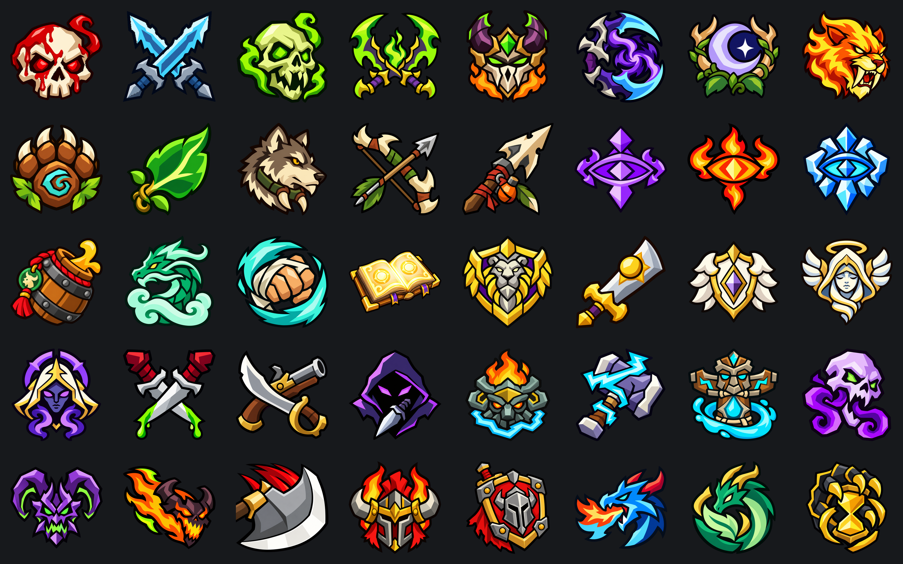

# Jiberish Fabled Icons

Custom class, race, and specialization artwork for World of Warcraft unit frames
and damage meters, with class and race icons for chat. Open **/ji** or **/jiberishicons** to configure.
Visit [The Igloo](https://theigloo.io/) for JiberishUI.

## Install or upgrade

The addon folder is now **JiberishIcons** and the visible name is **Jiberish Fabled Icons**.
Extract the release into `Interface/AddOns`, then fully restart WoW.
Existing users should follow [UPGRADING.md](UPGRADING.md) to retain saved profiles
when replacing the old `ElvUI_JiberishIcons` folder. Install only one folder name.

## Icon collections

**Fabled Specializations** includes all 40 specializations, including Devourer.
The revised designs use broader silhouettes, strong outlines, fewer internal
details and clearer color areas for small unit-frame and damage-meter icons.
The transparent 2048 × 2048 sheet uses 256px cells and at least four-pixel safety margins,
matching Fabled Regalia. Choose **Fabled Specializations (Spec)** in supported
Blizzard, ElvUI, Shadowed Unit Frames, EllesmereUI, or Details! selectors.

Your active specialization refreshes automatically. Classic/Forever characters
use the talent tree with the most spent points. Unspent builds and tied splits
show the Fabled Regalia class crest until a tree leads. Classic Feral Combat uses
the Feral icon; Combat Rogue uses Outlaw. Retail and Mists use their selected spec.
Forever reads the active build's talent-group totals, matching its talent window;
uncommitted previews retain the last known committed icon.
Other players display when public specialization information is available.
When a specialization icon needs data, nearby inspectable players are inspected
automatically outside combat. Forever uses their inspected talent-group totals;
confirmed results display immediately from a character-specific cache. After one
minute they refresh in the background while retaining the last confirmed icon,
with a five-minute hard expiry. Reported specialization changes invalidate the
old result immediately; zoning retains the cache and reloading clears it.
Current targets take priority over other queued players. Requests are throttled,
retry limits prevent spam, and manual inspection windows take priority. Unknown or
restricted specs hide until data arrives. Older Classic clients without usable
remote spec information can use class and race styles. These lookup and cache
rules apply to unit frames; damage meters use their recorded specialization data.
Chat and Eltruism retain their class/race capabilities.

**Fabled Regalia** includes all 13 class crests; **Fabled Azeroth** includes 26 race
crests, including Earthen and Haranir. Races available to both factions share an
emblem. Both use transparent 256px cells on 2048px sheets. Their artwork draws
inspiration from Blizzard Entertainment's official [class](https://worldofwarcraft.blizzard.com/en-us/game/classes)
and [race](https://worldofwarcraft.blizzard.com/en-us/game/races) crests.
See the [Regalia](images/FabledRegaliaWebsiteDisplay.png) and
[Azeroth](images/FabledAzerothWebsiteDisplay.png) previews.

**Fabled Core** preserves its original designs, carefully resampled and lightly
sharpened to 256px cells. Other existing packs retain their artwork and resolution.

## ElvUI tags

Find these under **Available Tags → Jiberish Fabled Icons** and paste them into a
unit frame's **Custom Text** field. The optional size defaults to 64 and accepts 1–128.

| Collection | Normal | Mirrored |
| --- | --- | --- |
| Specializations | `[jiberish:spec:fabledspecializations{32}]` | `[jiberish:spec:fabledspecializations:reverse{32}]` |
| Regalia classes | `[jiberish:class:fabledregalia{32}]` | `[jiberish:class:fabledregalia:reverse{32}]` |
| Azeroth races | `[jiberish:race:fabledazeroth{32}]` | `[jiberish:race:fabledazeroth:reverse{32}]` |

Existing class/race style tags continue to work. Tags hide when their required
identity information is unavailable. ElvUI and SUF race portraits use class
portrait mode; icon and portrait styles can be configured independently.

## Other integrations

- **Blizzard damage meter:** Open `/ji` → Damage Meters → Blizzard Damage Meter,
  enable it, and select **Fabled Specializations (Spec)** or a class pack. Enable
  Blizzard's stock meter in game settings and keep **Show Spec Icon** checked in
  Edit Mode. Edit Mode still controls layout, row size, and visibility; its previews
  use the chosen artwork. An **Open Blizzard Edit Mode** button is included.
- **Ellesmere damage meters:** Open `/ji` → Damage Meters → Ellesmere Damage Meters,
  enable it, and select a pack. Requires the **EllesmereUI Damage Meters** module;
  its Icon Style must be something other than **None**. The integration covers
  player rows and the pinned player across its windows. Ellesmere retains sizing,
  visibility, and spell artwork. Both meter integrations start disabled, support
  Reverse, and restore native icons when disabled. Unknown recorded specs use the
  Regalia class crest; meter icons do not trigger player inspection.
- **Details!:** Options → Bars: General → Icons → Texture → **Fabled Specializations (Spec)**.
  Details selects the artwork from each combatant's recorded specialization and
  keeps its normal class-icon fallback when a spec is unknown. Its compatible
  texture includes both Classic and Retail Rogue layouts. Existing class packs,
  including Fabled Regalia, remain available in the same menu.
- **EllesmereUI:** Open `/ji` → EllesmereUI and enable icons for Player, Target,
  Focus, Target of Target, Focus Target, or **Party**. Set the style, size, anchor,
  offsets, and reverse direction. Party uses the separate **EllesmereUI Raid Frames**
  module and applies one set of settings to its party buttons, including its self
  button. Other tabs require EllesmereUI Unit Frames. Apply To All copies complete
  settings to all six groups. Icons start disabled.
  They follow frame visibility and fading; changes to placement wait until combat
  ends. Party icons follow secure button reassignment and hide in layout previews.
- **Blizzard frames:** Open `/ji` → Blizzard Frames, choose the frame or Party,
  enable its icon or portrait, and select **Fabled Specializations (Spec)**.
- **ElvUI:** Use the specialization custom-text tags above on player, target, or
  party frames, or choose the pack in Jiberish's ElvUI portrait settings with
  ElvUI's class portrait mode enabled.
- **Reverse:** Mirror artwork in supported Blizzard, ElvUI, SUF, EllesmereUI, and
  Chat settings. This defaults to off and is saved per profile. Chat changes affect
  new messages. ElvUI custom text uses the mirrored tags above.

For contribution, validation and publishing, see [DEVELOPMENT.md](DEVELOPMENT.md).

Questions or concerns: [join the Discord](https://discord.gg/mJKdmm9KGr).
